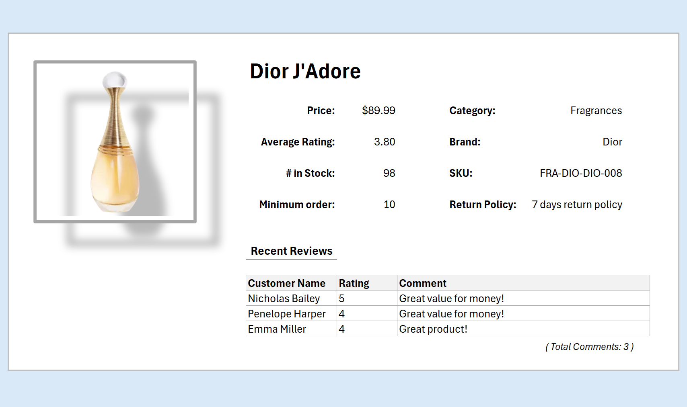

# API Product Intelligence Demo

This repository demonstrates the real power of the [ModernJsonInVBA VBA library](https://github.com/WilliamSmithEdward/ModernJsonInVBA) through a practical Excel + VBA case study. It shows how to quickly turn a public JSON API into a clean, interactive product dashboard with minimal VBA code complexity. This VBA library is approachable for any data analyst or Excel enthusiast, and allows you to rapidly prototype sophisicated data models & workflows.

\


## What the Demo Does

- Fetches live product catalog from https://dummyjson.com/products
- Loads the full list into a refreshable Excel Table (ListObject) in one function call
- Extracts nested reviews arrays from each product
- Adds a parentId foreign key to each review
- Creates a second relational table for all reviews
- Displays a simple dashboard sheet with dropdowns to browse products, see details, ratings, stock, and recent reviews

## Key Macros
```vba
Sub QueryProducts()
    ' One call to fetch and upsert products into a table
    Excel_UpsertListObjectFromJsonAtRoot ...
End Sub

Sub ExtractProductReviews()
    ' Loop over products, parse nested reviews, inject parentId, upsert to child table
    For Each rw In productTable.ListRows
        ...
        Excel_UpsertListObjectFromJsonAtRoot ...
    Next
End Sub
```

## Why This Shows the Power of ModernJsonInVBA

- Complex nested JSON becomes flat, relational Excel tables with minimal code
- Schema changes (new fields) are handled automatically — columns appear without breaking layouts
- No external libraries or COM objects required
- Works on Windows and Mac
- Fast enough for real dashboards and scheduled refreshes
- Clean upsert behavior: update existing rows, add missing columns, preserve order

## Features Highlighted

- Direct JSON → ListObject conversion
- Nested array flattening with parent-child relationships
- Safe JSON parsing and stringification helpers
- UI freeze prevention during processing
- Error handling that actually helps debugging

## How to Use

- Open API_Product_Intelligence_Model.xlsm
- Enable macros if prompted
- Click "Refresh Live API Data" to query the product data API in real-time
- Select a category and product
- Optional: Open the VBA editor (Developer tab, or ALT+F11) and explore the VBA code

## Summary

This is the perfect starting point for anyone building Excel tools that connect to REST APIs: e-commerce monitoring, inventory tracking, price comparison, review analysis, or any JSON-based data feed.
